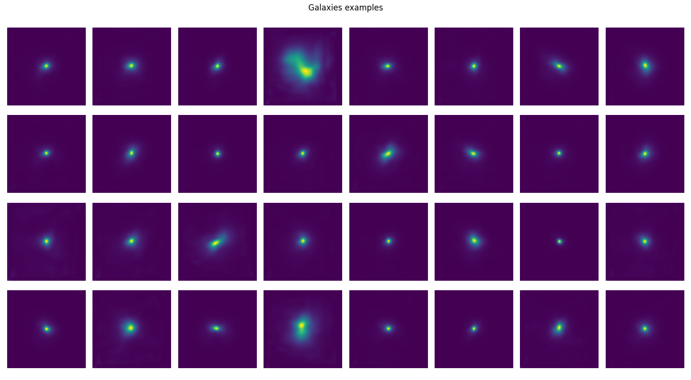
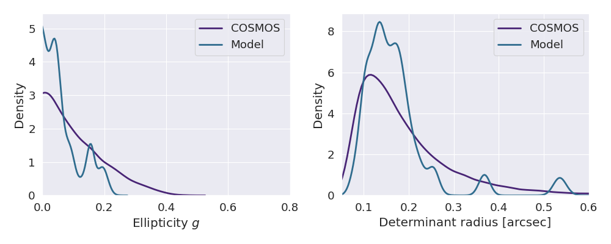

This repository aims to provide a code capable of creating a generative model of galaxies, making use of Variational AutoEncoders and Normalizing Flows. The model is inspired by the work carried out by [Lanusse, et al., 2021](https://arxiv.org/abs/2008.03833). The framework used for the models is [JAX](https://jax.readthedocs.io/en/latest/). 

## Installing JAX (GPU version)

First of all, we have to upgrade pip:
```
pip install --upgrade pip
```

Then we install JAX based on the CUDA version, in this case because it's CUDA 12.0 we use the following command: 
```
pip install --upgrade "jax[cuda12_pip]" -f https://storage.googleapis.com/jax-releases/jax_cuda_releases.html
```

Also we need to install FLAX in order to create NN with JAX:
```
pip install --quiet flax
```

Tensorflow_datasets is necessary to load the data:
```
pip install tensorflow-datasets
```

## Variational AutoEncoders (VAEs)

In order to learn an approximate probability distribution to characterize the morphology of galaxies, this deep generative model is used. The idea is to maximize the Evidence Lower Bound (ELBO), in order to maximize the marginal log-likelihood of galaxies. The details of this type of architecture are described in more detail by [Kingma and Welling, 2013](https://arxiv.org/abs/1312.6114)

Two approaches were performed: the first one based on the VAE proposed by [Lanusse, et al., 2021](https://arxiv.org/abs/2008.03833) and the second one based on the VAE used by the StableDiffusion model, proposed by [Rombach, et al., 2022](https://arxiv.org/abs/2112.10752). The codes to train each VAE are found in [VAE_Resnet_train_C.py](VAE_Resnet_train_C.py) and [VAE_SD_C.py](VAE_SD_C.py) respectively. 

It is important to note that in addition to the hyperparameters of the models (described in more detail in the FLAGS help of each code), it is also possible to change the depth of the model (number of ResNet Blocks, in order to decrease the dimension of the latent space). 

The following example shows that the latent space dimension is equivalent to $\frac{1}{16}$ of the original dimension of the images in the case of the [VAE_SD_C](https://github.com/JonnyyTorres/Galsim_JAX/blob/037a698e68a7a76c98e73b98aa121864ff49f734/VAE_SD_C.py#L140-L151) code:

```
## Initializing the AutoEncoder
Autoencoder = AutoencoderKLModule(
    ch_mult=(1, 2, 4, 8, 16),
    num_res_blocks=FLAGS.resblocks,
    double_z=True,
    z_channels=1,
    resolution=latent_dim,
    in_channels=1,
    out_ch=1,
    ch=1,
    embed_dim=1,
    act_fn=act_fn,
)
```

The parameter that indicates the depth of the model is _ch_mult_, a parameter that increases by a factor of $2^{n-1}$, where $n$ is the number of ResNet Blocks of both the Encoder and the Decoder. This factor must be changed manually within the code, in case you want to change the depth of the model. 

## Normalizing Flows (NFs)

Once the VAE (both Encoder and Decoder) has been trained, the correct prior distribution is learned in order to create a purely generative model. Once the correct prior distribution is learned, the Decoder is used to automatically generate galaxy images. Notebook [NF_Galsim](notebooks/NF_Galsim.ipynb) presents the model used using NFs for this purpose. 

Some of the examples obtained after sampling over the learned distribution are shown below:



Likewise, the [NF_Sampling](NF_Sampling.py) code shows examples of samples obtained from the distribution learned using NF.

Finally, notebook [NF_Galsim_moments](notebooks/NF_Galsim_moments.ipynb) shows how to calculate some physical parameters of the galaxies obtained, such as ellipticity, to compare with the results of the COSMOS dataset and thus evaluate the performance of the galaxies created.



## Contributors ✨

Thanks goes to these wonderful people ([emoji key](https://allcontributors.org/docs/en/emoji-key)):

<!-- ALL-CONTRIBUTORS-LIST:START - Do not remove or modify this section -->
<!-- prettier-ignore-start -->
<!-- markdownlint-disable -->
<table>
  <tr>
    <td align="center"><a href="https://github.com/JonnyyTorres"><br /><sub><b>Jonnyy Torres</b></sub></a><br /><a href="https://github.com/JonnyyTorres/Galsim_JAX/commits?author=JonnyyTorres" title="Code">💻</a></td>
    <td align="center"><a href="http://flanusse.net"><br /><sub><b>Francois Lanusse</b></sub></a><br /><a href="#ideas-EiffL" title="Ideas, Planning, & Feedback">🤔</a> <a href="#code-EiffL" title="Code">💻</a></td>
    <td align="center"><a href="https://www.cosmostat.org/people/benjamin-remy"><br /><sub><b>Benjamin Remy</b></sub></a><br /><a href="https://github.com/JonnyyTorres/Galsim_JAX/issues/created_by/b-remy" title="Ideas, Planning, & Feedback">🤔</a><a href="https://github.com/JonnyyTorres/Galsim_JAX/commits?author=b-remy" title="Code">💻</a><a href="#bugs-bremy" title="Bug reports">🐛</a></td>
</table>


<!-- markdownlint-restore -->
<!-- prettier-ignore-end -->

<!-- ALL-CONTRIBUTORS-LIST:END -->

This project follows the [all-contributors](https://github.com/all-contributors/all-contributors) specification. Contributions of any kind welcome!